# Day 2 — Liberty Files, Hierarchical/Flat Synthesis, and Flip-Flops
## Theory Topics Covered

### Timing Libraries

Timing libraries, commonly stored as `.lib` files, contain timing and electrical information about standard cells used during synthesis. These libraries define:

- Propagation delays
- Power consumption
- Pin characteristics
- Timing constraints
- Operating voltage and temperature conditions

Synthesis tools use these libraries to map RTL logic into real hardware.

---

### SKY130 PDK Overview

The SKY130 PDK (Process Design Kit) is an open-source 130nm semiconductor technology kit developed through the Google-SkyWater collaboration.

It provides:

- Standard cell libraries
- Device models
- Timing information
- Physical design data
- SPICE models

The SKY130 ecosystem enables open-source VLSI design and fabrication workflows.

---

### Hierarchical Synthesis

Hierarchical synthesis preserves the structure and modular organization of a design during synthesis. Each module is synthesized independently while maintaining module boundaries.

Advantages include:

- Easier debugging
- Better module reuse
- Faster synthesis for large designs

---

### Flat Synthesis

Flat synthesis removes module hierarchy by combining all modules into a single large design before optimization.

Advantages include:

- Better global optimization
- Reduced redundant logic
- Potential area and timing improvements

However, flat synthesis can make debugging more difficult in very large designs.

---

### Flip-Flop Coding Styles

Flip-flops are sequential storage elements used to store binary information. Different coding styles produce different hardware behaviors.

The workshop explored:

- Asynchronous Reset D Flip-Flops
- Asynchronous Set D Flip-Flops
- Synchronous Reset D Flip-Flops

These are widely used in processors, controllers, counters, and memory systems.

---

### Asynchronous Reset

An asynchronous reset forces the output of a flip-flop into a known state immediately, without waiting for a clock edge.

This is commonly used in emergency shutdown or safety-critical systems.

---

### Asynchronous Set

An asynchronous set immediately drives the output high when activated, independent of the clock.

This is useful when systems must initialize into a logic-high state instantly.

---

### Synchronous Reset

A synchronous reset changes the flip-flop output only on a clock edge. Unlike asynchronous resets, it remains synchronized with the clock signal.

Synchronous resets help reduce timing-related issues in digital systems.

---


## Labs

Day 2 went deeper into understanding the Sky130 library file, the difference between hierarchical and flat synthesis, and how different types of flip-flops are coded, simulated, and synthesized.

---

### 1. Viewing the Sky130 Liberty (.lib) File

```bash
gvim /home/vsduser/VLSI/sky130RTLDesignAndSynthesisWorkshop/lib/sky130_fd_sc_hd__tt_025C_1v80.lib
```

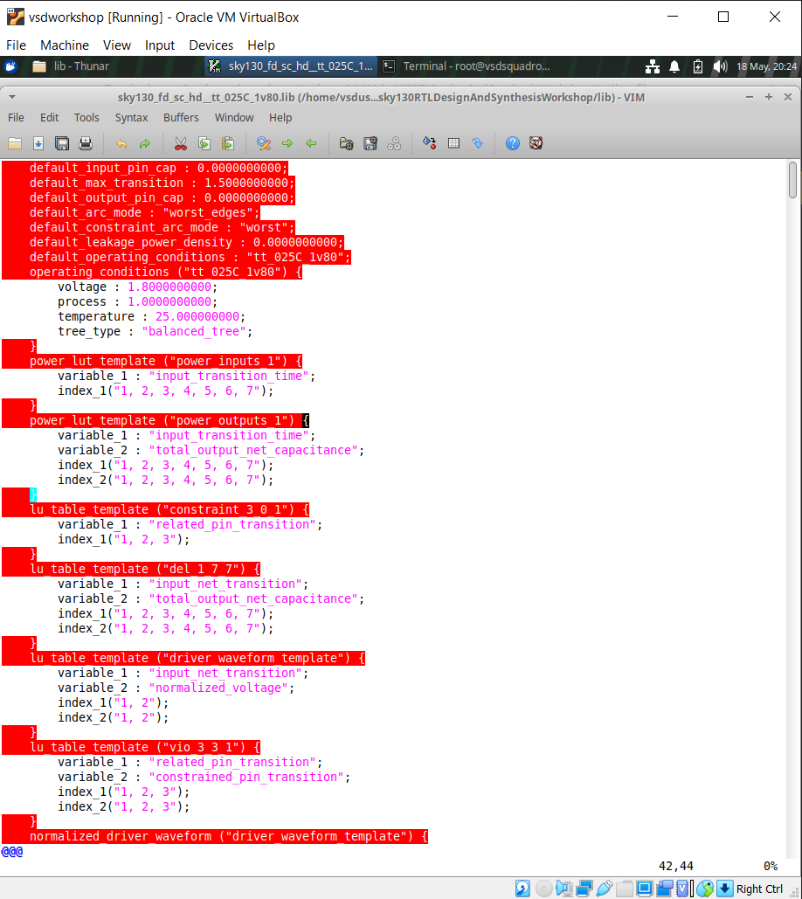

The **Liberty (.lib) file** is essentially a catalog of all the real hardware cells the synthesis tool can use. Opening it gives information about:

- The **process conditions** the library was characterized at (temperature: 25°C, voltage: 1.8V)
- All available **gates and cells** (AND, OR, NOT, flip-flops, etc.)
- **Timing information** — how fast each gate is
- **Power consumption** of each cell
- **Pin descriptions** — inputs, outputs, and their behavior

Understanding the `.lib` file helps appreciate what's happening "under the hood" when Yosys picks cells during synthesis.

---

### 2. Hierarchical and Flat Synthesis

### Hierarchical Synthesis

**Hierarchical Synthesis** preserves the module structure of the original design. When a top-level module that contains sub-modules is synthesized, the synthesis result still shows those sub-modules as distinct blocks instead of collapsing everything into a flat list of gates.

#### Running Hierarchical Synthesis

Inside Yosys:

```bash
read_liberty -lib /home/vsduser/VLSI/sky130RTLDesignAndSynthesisWorkshop/lib/sky130_fd_sc_hd__tt_025C_1v80.lib
read_verilog multiple_modules.v
synth -top multiple_modules
```

From the report generated, it can be seen that `sub_module1` has an AND gate, `sub_module2` has an OR gate, and the entire design has a total of 2 gates — 1 AND gate and 1 OR gate.

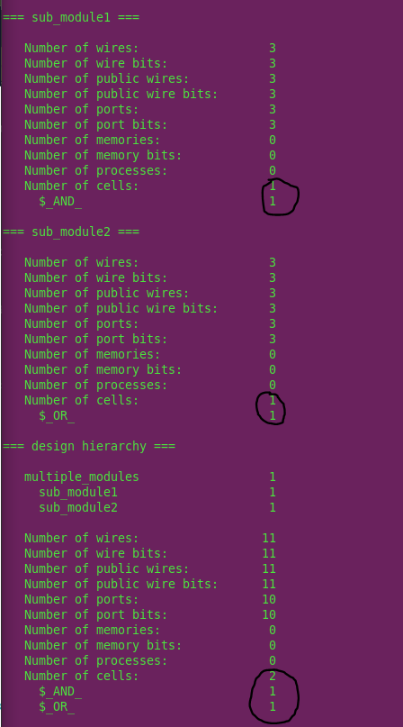

```bash
abc -liberty /home/vsduser/VLSI/sky130RTLDesignAndSynthesisWorkshop/lib/sky130_fd_sc_hd__tt_025C_1v80.lib
show multiple_modules
```

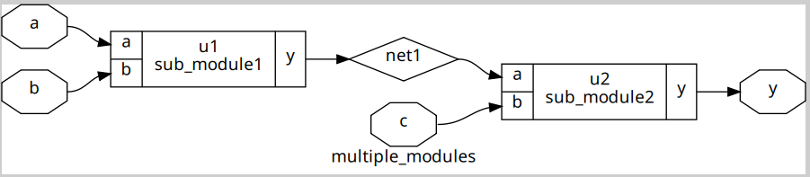

Here, it can be seen that the gates have been instantiated in the form of their respective modules, rather than as direct gates. This type of representation is called a **hierarchical design**, as the hierarchy of the design is preserved.

#### Writing the Hierarchical Netlist

```bash
write_verilog -noattr multiple_modules_hier.v
!gvim multiple_modules_hier.v
```

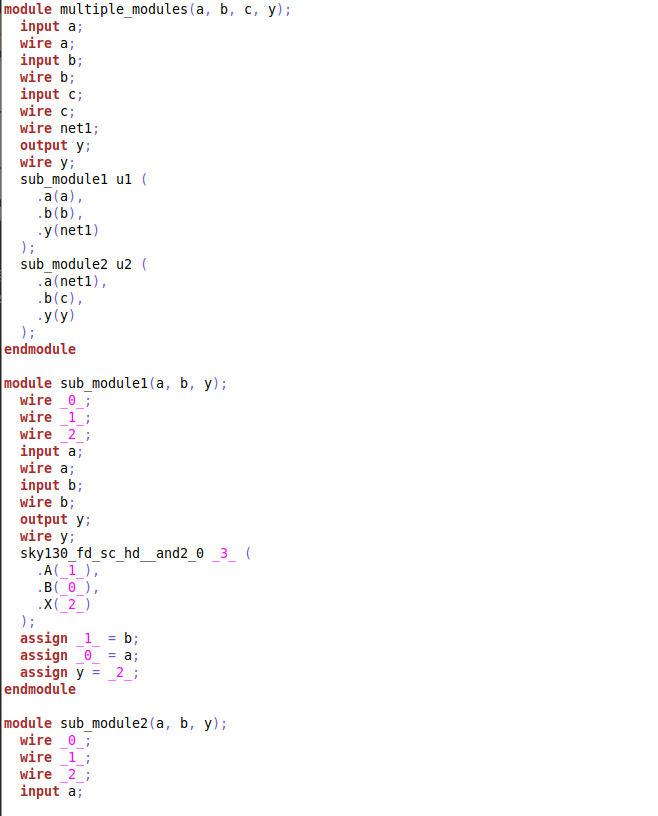

As seen above, the hierarchy of the code is still preserved. This is an example of hierarchical synthesis.

---

### Flat Synthesis

**Flat Synthesis** collapses all modules into a single flattened netlist. There are no sub-module references anymore — just the raw underlying gates.

Continuing from inside the same Yosys session:

```bash
flatten
write_verilog -noattr multiple_modules_flat.v
!gvim multiple_modules_flat.v
```

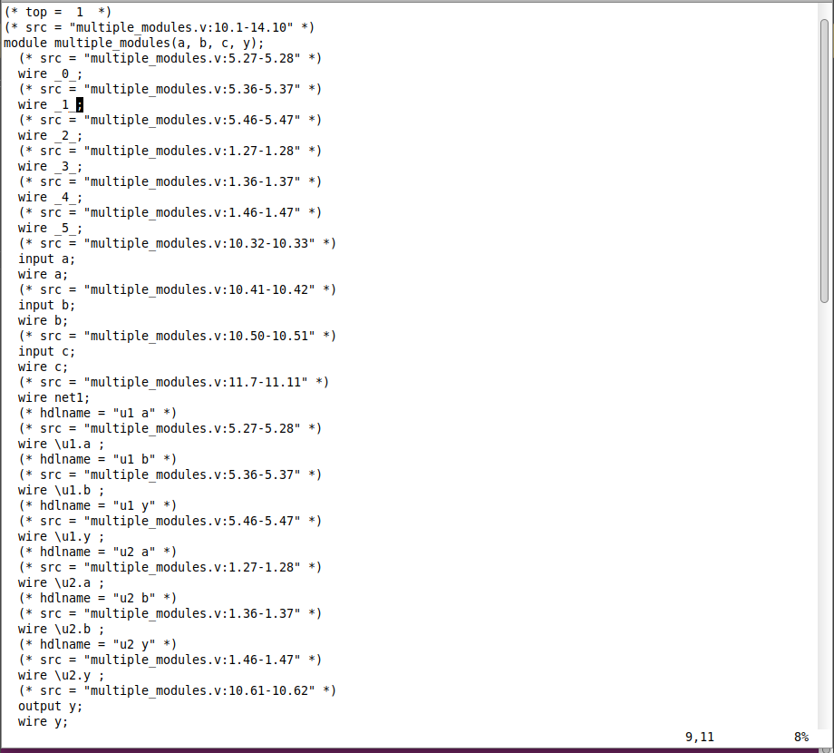

Here, it can be seen that the file is not in the proper hierarchy from before, and that all the modules are compressed into the same file. This is an example of flat synthesis. The `sub_modules` are not visible; instead, the underlying components of the sub-modules are shown.

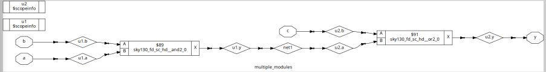

> **Sub-module synthesis tip:** A single sub-module can also be synthesized using `synth -top <sub_module_name>`. This is especially useful for large designs or when a module is repeated many times — synthesize once, and reuse the result everywhere it appears (similar to how a CPU cache reuses data).

#### When to Use Each Type

| Type | Use When |
|------|----------|
| Hierarchical | Large designs where readability and modularity matter |
| Flat | Optimizing across module boundaries |
| Sub-module synthesis | A module is repeated many times (synthesize once, reuse) |

---

### 3. Learning About Flops

A **flip-flop** stores a single bit of data. Its primary role in digital design is to:
- Remove glitches between combinational logic stages
- Keep the entire design synchronized with a clock signal

Three types of flip-flop resets/sets were explored.

---

### 3a. Asynchronous Reset

The output `q` goes LOW **immediately** when reset is asserted, without waiting for the next clock edge.

**Use case:** Emergency shutdown systems — waiting for the next clock edge in a safety-critical situation is not an option.

```verilog
module dff_asyncres (input clk, input async_reset, input d, output reg q);
  always @ (posedge clk, posedge async_reset)
    if (async_reset)
      q <= 1'b0;
    else
      q <= d;
endmodule
```

**Simulation commands:**
```bash
iverilog dff_asyncres.v tb_dff_asyncres.v
./a.out
gtkwave tb_dff_asyncres.vcd
```

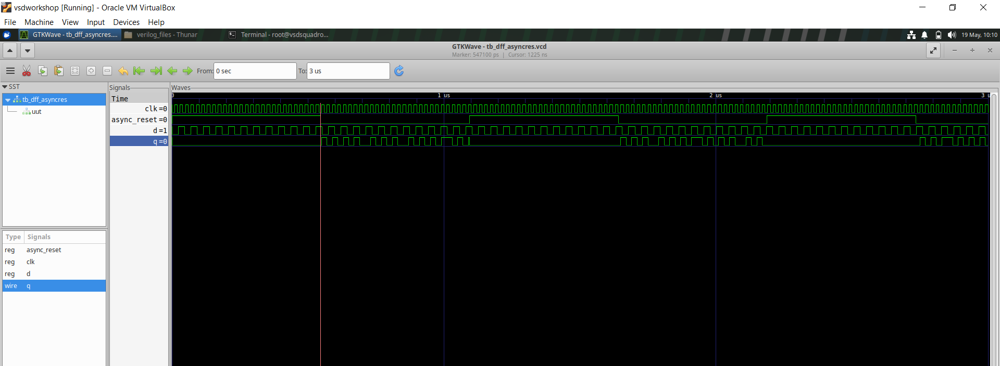

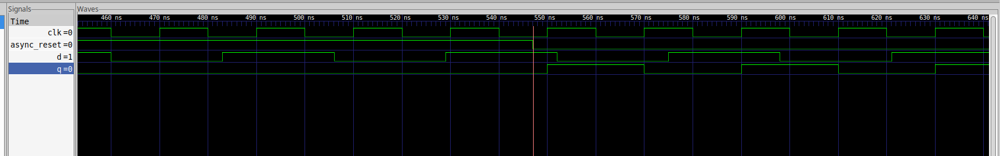

Clearly, the asynchronous reset goes low before the clock, so the `q` pin (output) is synchronized with the clock and takes the value of `d` whenever there is a posedge.

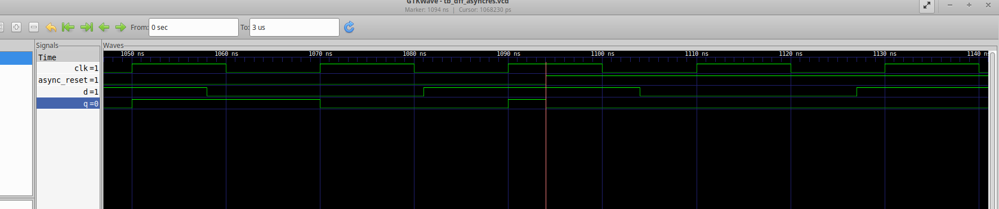

Here, before reset became high, the `q` pin became high on the clock posedge since the `d` pin was high. However, after the reset came, `q` is no longer synchronized with the clock, and became low immediately after the reset was asserted. This is asynchronous reset's core functionality.

---

### 3b. Asynchronous Set

The output `q` goes HIGH **immediately** when set is asserted, without waiting for the next clock edge.

```verilog
module dff_async_set (input clk, input async_set, input d, output reg q);
  always @ (posedge clk, posedge async_set)
    if (async_set)
      q <= 1'b1;
    else
      q <= d;
endmodule
```

**Simulation commands:**
```bash
iverilog dff_async_set.v tb_dff_async_set.v
./a.out
gtkwave tb_dff_async_set.vcd
```

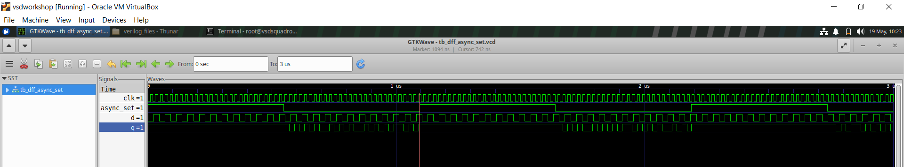

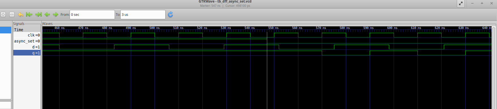

Here, as the set is low, the `q` pin follows the clock as usual and takes the value of the `d` pin at every posedge.

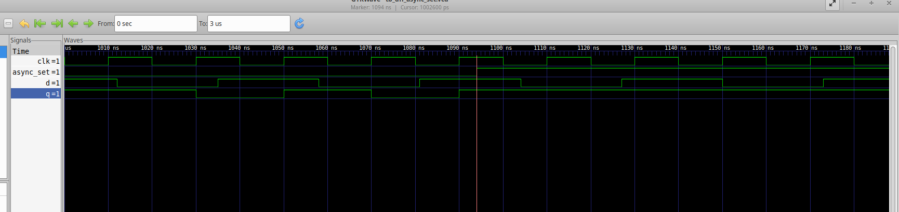

Here, the set becomes high. Thus, the `q` pin does not wait for the next posedge to become high, but instead directly becomes high without being synchronized with the clock. This is the functionality of an asynchronous set.

---

### 3c. Synchronous Reset

In a synchronous reset, the `q` pin waits for the clock's posedge to become LOW if the reset is high.

```verilog
module dff_syncres (input clk, input async_reset, input sync_reset, input d, output reg q);
  always @ (posedge clk)
    if (sync_reset)
      q <= 1'b0;
    else
      q <= d;
endmodule
```

**Simulation commands:**
```bash
iverilog dff_syncres.v tb_dff_syncres.v
./a.out
gtkwave tb_dff_syncres.vcd
```

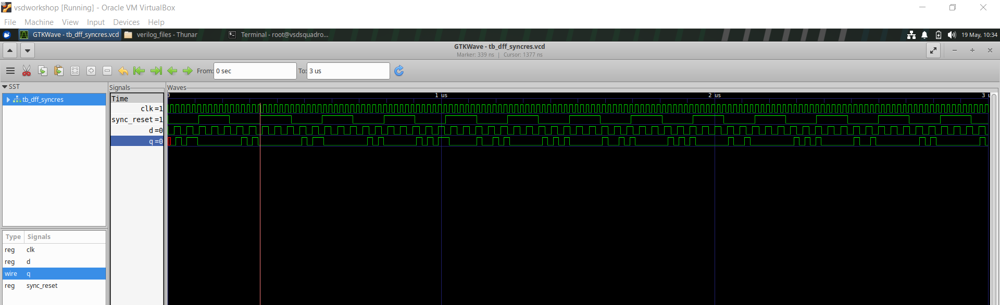

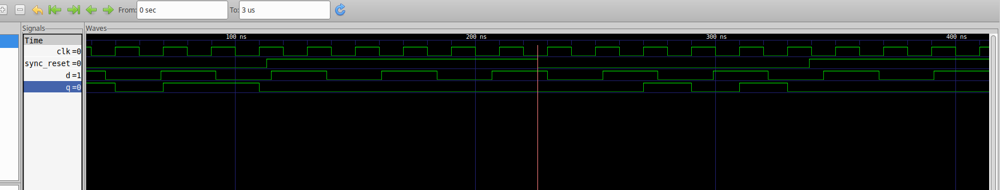

Here, the reset went low, so the `q` pin follows the clock posedge as normal.

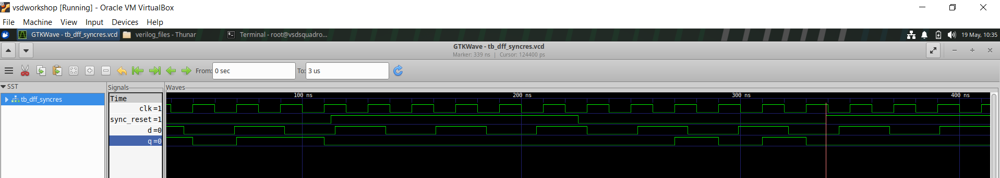

However, when the reset became high, unlike an asynchronous reset, the `q` pin waits for the clock's posedge to become low. Thus, the `q` pin is "synchronized" with the clock even when a reset occurs. This is the functionality of a synchronous reset.

---

### 4. Synthesizing Flops

When synthesizing flip-flops, the `dfflibmap` command must be run **before** `abc` to tell Yosys which flip-flop cells to use from the library.

### Synthesizing Asynchronous Reset

```bash
yosys
read_liberty -lib /home/vsduser/VLSI/sky130RTLDesignAndSynthesisWorkshop/lib/sky130_fd_sc_hd__tt_025C_1v80.lib
read_verilog dff_asyncres.v
synth -top dff_asyncres
dfflibmap -liberty /home/vsduser/VLSI/sky130RTLDesignAndSynthesisWorkshop/lib/sky130_fd_sc_hd__tt_025C_1v80.lib
abc -liberty /home/vsduser/VLSI/sky130RTLDesignAndSynthesisWorkshop/lib/sky130_fd_sc_hd__tt_025C_1v80.lib
show
```

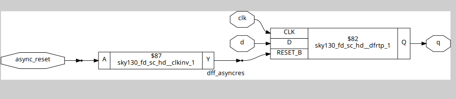

### Synthesizing Asynchronous Set

```bash
yosys
read_liberty -lib /home/vsduser/VLSI/sky130RTLDesignAndSynthesisWorkshop/lib/sky130_fd_sc_hd__tt_025C_1v80.lib
read_verilog dff_async_set.v
synth -top dff_async_set
dfflibmap -liberty /home/vsduser/VLSI/sky130RTLDesignAndSynthesisWorkshop/lib/sky130_fd_sc_hd__tt_025C_1v80.lib
abc -liberty /home/vsduser/VLSI/sky130RTLDesignAndSynthesisWorkshop/lib/sky130_fd_sc_hd__tt_025C_1v80.lib
show
```

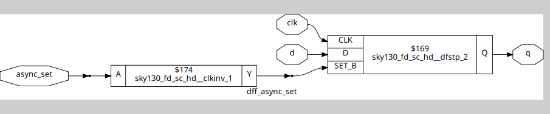

### Synthesizing Synchronous Reset

```bash
yosys
read_liberty -lib /home/vsduser/VLSI/sky130RTLDesignAndSynthesisWorkshop/lib/sky130_fd_sc_hd__tt_025C_1v80.lib
read_verilog dff_syncres.v
synth -top dff_syncres
dfflibmap -liberty /home/vsduser/VLSI/sky130RTLDesignAndSynthesisWorkshop/lib/sky130_fd_sc_hd__tt_025C_1v80.lib
abc -liberty /home/vsduser/VLSI/sky130RTLDesignAndSynthesisWorkshop/lib/sky130_fd_sc_hd__tt_025C_1v80.lib
show
```

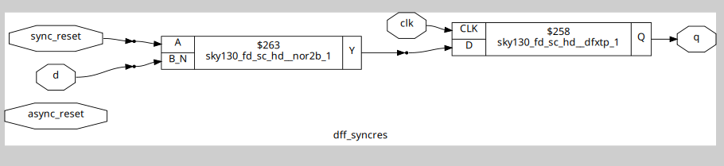

---

### 5. Interesting Optimizations

If there is a multi-bit input and a wider output, the synthesis tool can sometimes realize the output is just a shifted version of the input — and implement it with no gates at all (just wires).

**Example:** A 3-bit input mapped to a 4-bit output where the output = input with a `0` appended at the MSB. This is equivalent to multiplying by 2, which in binary is just a left shift — no logic gates needed.

```
Input  = 3  (011)  →  Output = 3  (0011)
Input  = 6  (110)  →  Output = 6  (0110)
```

---

## Key Takeaways from Day 2

- The `.lib` file is the synthesis tool's "parts catalog" of real hardware cells
- Hierarchical synthesis keeps module boundaries; flat synthesis removes them
- `dfflibmap` is required before `abc` when synthesizing flip-flops
- Asynchronous resets/sets act immediately; synchronous ones wait for the clock edge

---
